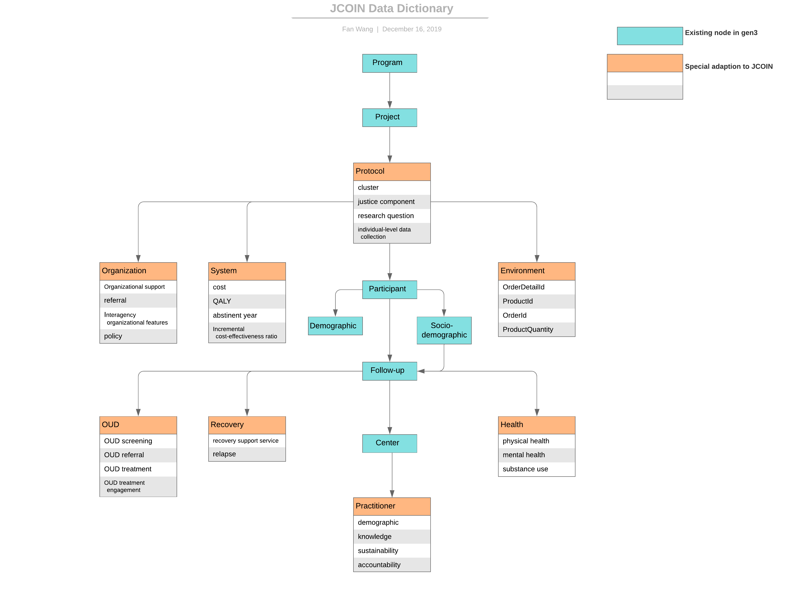

# Data Dictionary

The JCOIN Data Dictionary (https://jcoin.datacommons.io/dd) provides the first level of validation for all data
stored in and generated by the JCOIN.

Written in YAML, the JSON schemas define all the individual entities
(nodes) in the data model and define all of the relationships (links)
between the nodes. These schemas define the valid key-value pairs that can be used to
describe the nodes.

Read more information about the Data Dictionary structure in Gen3 here:
https://github.com/uc-cdis/gen3-userservices-info/blob/master/data_dictionary/data_dictionary_readme.md
